# Projet : Chatbot Agentique avec Spring AI et MCP

----
### Nom et Prénom : Anejjar Wiame
### Filière: MSDIA

----

## 📌 Objectif du TP
Ce projet vise à développer une application de chatbot de nouvelle génération, capable d'interagir
de manière intelligente et contextuelle avec les utilisateurs. Au cœur de cette solution se trouve l'intégration 
du protocole MCP (Multi-Agent Communication Protocol), permettant une communication fluide entre différents services et agents,
qu'ils soient développés en Java (Spring), Python ou NodeJS.   
Plus spécifiquement, les objectifs incluent de savoir :
  - Architecture et Spécifications du Protocole MCP
  - Comment créer un serveur MCP SSE avec Java Spring
  - Comment Tester le serveur MCP avec Postman
  - Comment Créer un Client MCP avec Spring AI, Llama3.1, Claude et OpenAI
  - Comment déployer un serveur MCP NodeJS en mode STDIO dans le client MCP Spring AI
  - Comment Créer un serveur MCP avec Python
  - Comment déployer un serveur MCP Python en mode STDIO dans le client MCP Spring AI
  - Comment rendre l'application Agentique

---
## 🧱 Structure du Projet

Le projet mcp-demo-spring-python est organisée pour séparer les responsabilités et faciliter le développement. Il se compose des modules principaux suivants :

  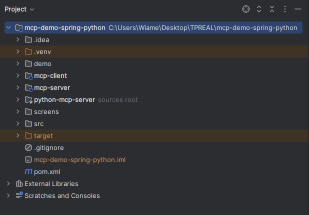

  - Mcp-client :  
Ce module est côté client. Il est développé en Java avec Spring Boot et utilise Spring AI.  Son rôle il reçoit les requêtes des utilisateurs, les traite en utilisant des modèles d'IA externes (Llama3.1, Claude, OpenAI) via Spring AI, et interagit avec les serveurs MCP pour exécuter des outils spécifiques.  
     - Fonctionnalités clés :  
Interface avec les modèles de langage via Spring AI.  
Gestion des conversations et du contexte utilisateur.  
Découverte et appel des outils exposés par les serveurs MCP.  
Peut inclure des agents (AIAgent) et des contrôleurs REST (AIRestController) pour exposer des API.

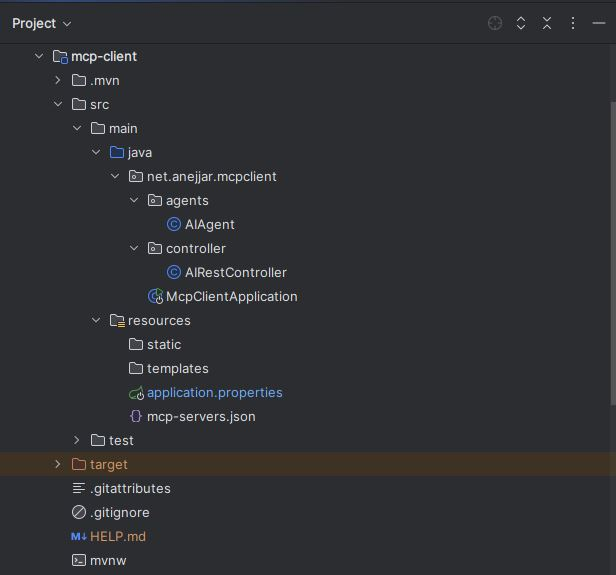

  - Mcp-server:  
Ce module représente le serveur MCP développé en Java avec Spring Boot. Son rôle c'est qu'il expose des fonctionnalités (outils) spécifiques via le protocole MCP. Ces outils peuvent être appelés par le mcp-client ou d'autres clients MCP.  
    - Fonctionnalités clés :  
Implémentation de services métier (StockTolls.java pour des outils liés aux actions).  
Exposition de ces services en tant qu'outils MCP.  
Peut fonctionner comme un serveur SSE (Server-Sent Events) pour une communication en temps réel.

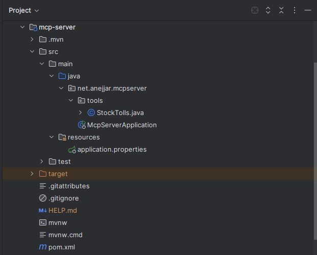

   - Python-mcp-server :  
Ce module est un exemple de serveur MCP développé en Python. Son rôle est similaire au mcp-server Java, il expose des fonctionnalités (outils) spécifiques, mais implémentées en Python. Cela démontre la capacité du protocole MCP à intégrer des services développés dans différents langages.  
     - Fonctionnalités clés :  
Implémentation de logiques métier en Python (server.py pour des informations sur les employés).  
Exposition de ces logiques en tant qu'outils MCP.  
Peut être déployé en mode STDIO (Standard Input/Output) pour une communication directe avec le client MCP Spring AI.

## Technologies Utilisées
Backend : Java (Spring Boot, Spring AI), Python, NodeJS  
Protocoles : MCP (Multi-Agent Communication Protocol), SSE  
Modèles d'IA : Llama3.1  

## 📄 Explication détaillée d'implémentation de projet

## Module mcp-server:
### 1. Classe StockTools.java :  
  Le fichier StockTolls.java, situé dans le package net.anejjar.mcpserver.tools, définit un outil de gestion fictive d'informations sur des entreprises, utilisé dans le contexte d'une application basée sur Spring AI. Il contient une liste prédéfinie de sociétés marocaines représentées par la classe Company, incluant des données comme l’activité, le chiffre d'affaires, le nombre d’employés et le pays. À travers l’utilisation de l’annotation @Tool, plusieurs méthodes sont exposées comme des outils accessibles à des agents intelligents : getAllCompanies() permet de récupérer la liste complète des entreprises, getCompanyByName(String name) retourne une entreprise en fonction de son nom, et getStockByCompanyName(String name) génère un objet Stock avec une valeur aléatoire simulant un prix de marché. 
  
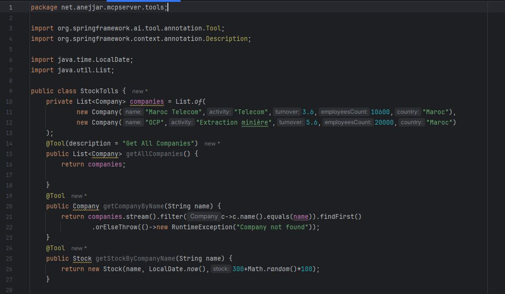
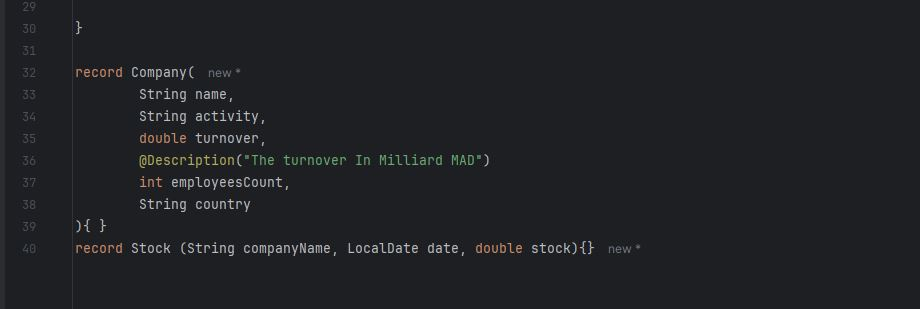
  
### 2. Classe MCPServerApplication :

Le fichier McpServerApplication.java constitue la classe principale de l'application Spring Boot située dans le module mcpserver. Grâce à l’annotation @SpringBootApplication, il sert de point d’entrée pour le lancement de l'application via la méthode main(). Une configuration essentielle y est déclarée avec la méthode annotée @Bean, qui expose un objet MethodToolCallbackProvider. Ce composant permet de rendre disponible la classe StockTolls comme source d'outils exploitables par Spring AI. En effet, sans cette déclaration, les méthodes annotées avec @Tool dans StockTolls ne seraient jamais reconnues ni exécutables dans le contexte de l'application. Ce code montre donc comment intégrer et activer dynamiquement des outils personnalisés.

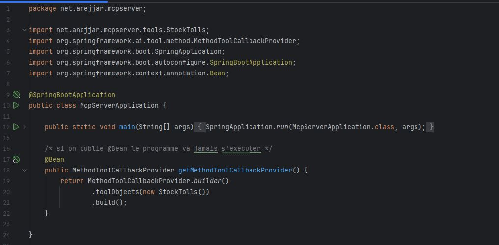

### 3. Application.properties :  

Ce fichier permet de spécifier la configuration principale du serveur Spring Boot, notamment les paramètres liés au serveur MCP (Model Context Protocol), aux endpoints, au port d’exécution et au niveau de journalisation.    

  - spring.application.name=mcp-server : définit le nom de l'application Spring Boot.  
  - Configuration du serveur MCP (Model Context Protocol) :  
       - spring.ai.mcp.server.name=spring-mcp-server : le nom interne du serveur MCP.  
       - spring.ai.mcp.server.type=sync : mode de traitement (synchrone).  
       - spring.ai.mcp.server.version=1.0.0 : version déclarée du serveur.  
       - spring.ai.mcp.server.sse-endpoint=/sse : endpoint pour les connexions SSE (Server-Sent Events).  
       - spring.ai.mcp.server.sse-message-endpoint=/mcp/message : endpoint pour l’envoi des messages SSE.  
       - spring.ai.mcp.server.prompt-change-notification=true , spring.ai.mcp.server.tool-change-notification=true , spring.ai.mcp.server.resource-change-notification=true : ces trois lignes activent les notifications automatiques en cas de changement de prompt, d’outil ou de ressource.  
  - Configuration du serveur HTTP :  
         - server.port=8899 : le serveur tourne sur le port 8899.  
  - Configuration des logs:  
       - logging.level.io.modelcontextprotocol=TRACE , logging.level.org.springframework.ai.mcp=TRACE : permet d’avoir un niveau de log très détaillé (TRACE) sur le protocole MCP et sur Spring AI.
   
    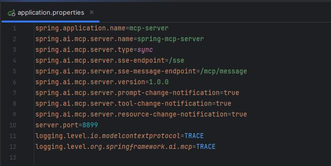

## Module mcp-client:

Le module mcp-client contient deux packages principaux : agents, qui regroupe la logique des agents intelligents, et controller, qui expose une interface REST pour interagir avec ces agents.

### 1. Package agents : 
#### Classe AIAgent : 
La classe AIAgent, annotée avec @Service, représente un agent conversationnel basé sur l’API de Spring AI. Elle utilise un objet ChatClient pour interagir avec un LLM (Large Language Model). Lors de sa construction, l’agent est configuré pour utiliser des outils (via ToolCallbackProvider), une instruction système par défaut (pour guider les réponses), ainsi qu’un système de mémoire conversationnelle à fenêtre glissante (MessageWindowChatMemory) permettant de garder en mémoire les 20 derniers messages. Cela rend l’agent capable de fournir des réponses contextualisées. La méthode askLLLM(String query) est ensuite utilisée pour envoyer une requête utilisateur au LLM et récupérer la réponse générée.

  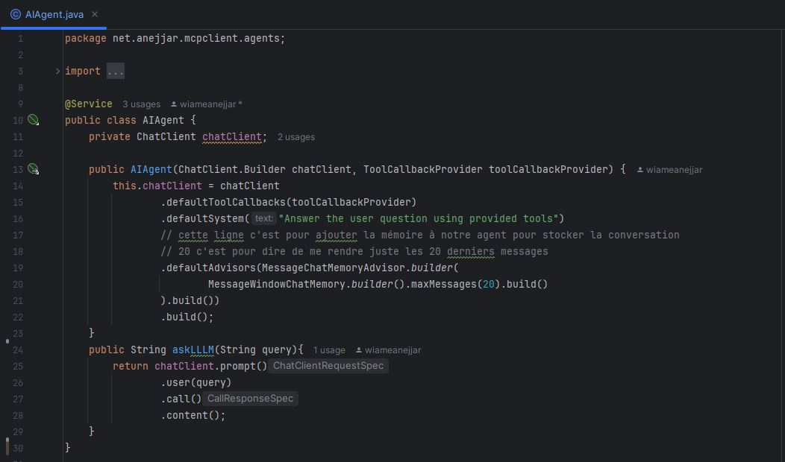

### 2. Package Controller : 
#### Classe AIRestController :

La classe AIRestController, annotée avec @RestController, expose une API REST pour communiquer avec l’agent intelligent défini précédemment. Elle contient une seule route GET /chat qui prend une requête utilisateur (query) en paramètre et la transmet à l’agent via la méthode askLLLM. Cette structure permet d'interagir facilement avec l'agent depuis une interface web, un client mobile, ou toute autre application externe. En séparant clairement la logique de l'agent (dans le package agents) et la couche d’exposition REST (dans controller), on suit une bonne pratique de conception logicielle (séparation des responsabilités).

  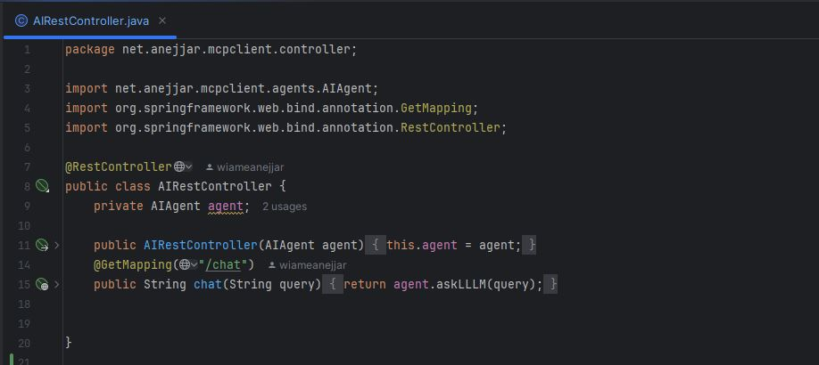

  
### 3. Classe McpClientApplication  :

La classe McpClientApplication constitue le point d’entrée du module mcp-client. En plus du démarrage classique d’une application Spring Boot, elle utilise un CommandLineRunner pour interagir automatiquement avec un ou plusieurs clients MCP (McpSyncClient). Lors de l'exécution, le code récupère la liste des outils disponibles fournis par le serveur MCP, affiche leurs métadonnées (nom, description, schéma d’entrée), puis appelle automatiquement l’outil getCompanyByName avec un paramètre JSON (par exemple "name": "OCP"). Si le contenu retourné est de type texte, le résultat est affiché dans la console. Ce mécanisme montre comment consommer dynamiquement des outils distants (via MCP) depuis un client Java, tout en respectant le protocole d’échange défini par Model Context Protocol.

  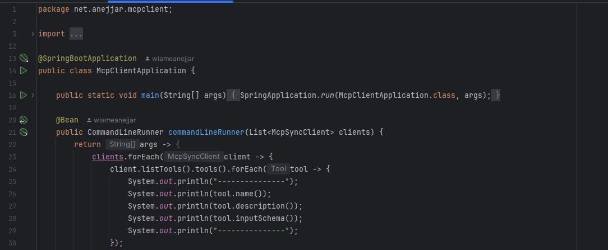
  

### 4. Application.properties : 
Ce fichier configure le client MCP. Il :  
    - Définit le nom de l’application (mcp-client).
    - Indique que le type de client est synchrone (sync).
    - Etablit une connexion SSE avec un serveur MCP distant (à l’URL http://localhost:8899 et endpoint /sse).
    - Précise un fichier mcp-servers.json pour la configuration d’autres serveurs via la ligne de commande (stdio).
    - Et configure l’URL et le modèle du LLM utilisé via Ollama (llama3.1 localement).

  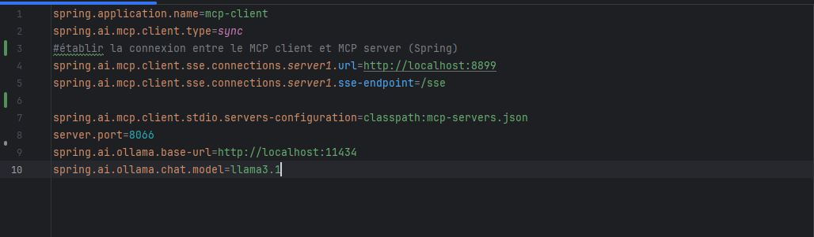

### 5. Mcp-server.json : 
Ce fichier JSON liste les serveurs MCP externes que le client peut démarrer et gérer via la ligne de commande (stdio). Il décrit deux serveurs : un serveur Node.js (server-filesystem) lancé avec npx, et un serveur Python (python-mcp) lancé avec uv pour exécuter un script server.py. Les chemins et variables d’environnement nécessaires à chaque lancement sont également définis, permettant une intégration flexible et multiplateforme des serveurs MCP dans le projet.

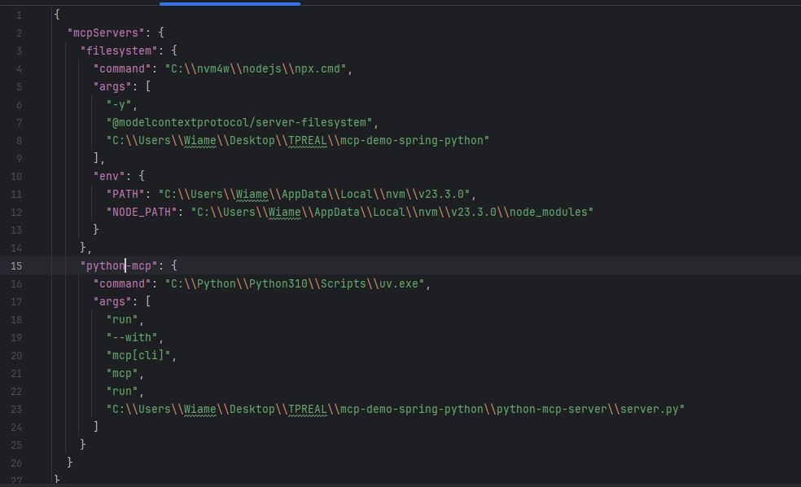

# Teste de serveur MCP avec Postman : 

#### Interface Postman - Outils MCP disponibles (getStockByCompanyName, getAllCompanies, getCompanyByName)
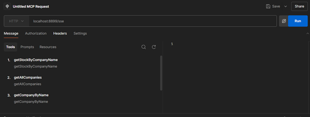

#### Requête MCP - Appel de l'outil getAllCompanies et Réponse JSON
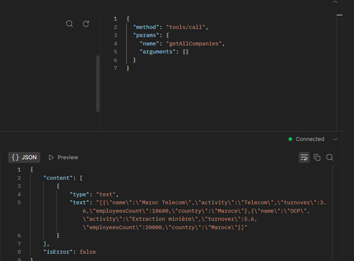

#### Requête MCP - Appel de l'outil getCompanyByName avec argument 'OCP'
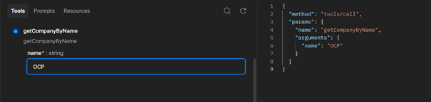

#### Connexion au Serveur MCP SSE via Postman (GET /sse)
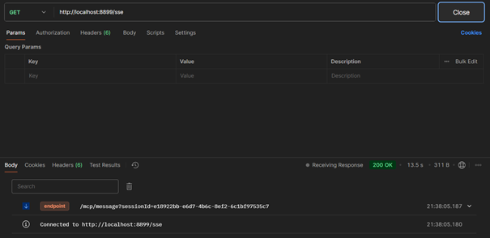

#### Requête MCP - Initialisation de la session (POST /mcp/message)
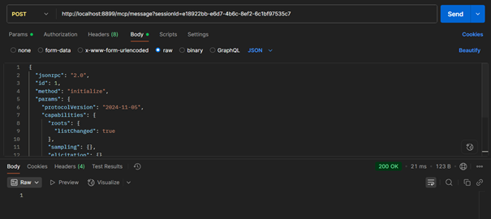

#### Messages reçus du Serveur MCP SSE (message, mcp/message)

## Module Python-mcp-server:
### Server.py: 
Ce script Python définit un outil MCP à l’aide de la classe FastMCP du module mcp.server.fastmcp. Il expose une seule fonction nommée get_employee_info, marquée comme outil MCP grâce au décorateur @mcp.tool (sert à déclarer une fonction comme un outil MCP). Cette fonction prend un nom en entrée et retourne un dictionnaire contenant ce nom et un salaire fixe. L’appel à mcp.run(transport="stdio") permet de lancer le serveur en mode stdio, c’est-à-dire qu’il communique par l’entrée/sortie standard avec un client MCP. Ce fichier est utilisé indirectement via la configuration déclarée dans le fichier mcp-servers.json (déjà référencé dans application.properties du module mcp-client) : ce fichier JSON contient la commande pour lancer ce script Python en tant que serveur MCP dans la section "python-mcp", permettant ainsi au client Spring d’interagir dynamiquement avec ce serveur Python.

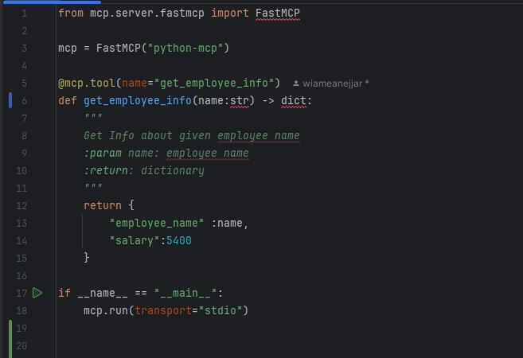

## Problèmes rencontrés : 
Lors de l'exécution du projet, j’ai rencontré des difficultés techniques sur mon ordinateur. Malgré une bonne configuration de l’environnement Python, le fichier server.py n’est pas reconnu comme un environnement Python exécutable. De plus, lorsque je lance une commande comme ollama run llama3.1 par exemple, le processus reste bloqué sans afficher de réponse, même après un long moment. J’ai essayé plusieurs solutions pour corriger ces problèmes (modification des chemins, réinstallation, vérification des dépendances), mais le blocage persiste, ceci est probablement à cause de limitations matérielles ou de performance de ma machine.

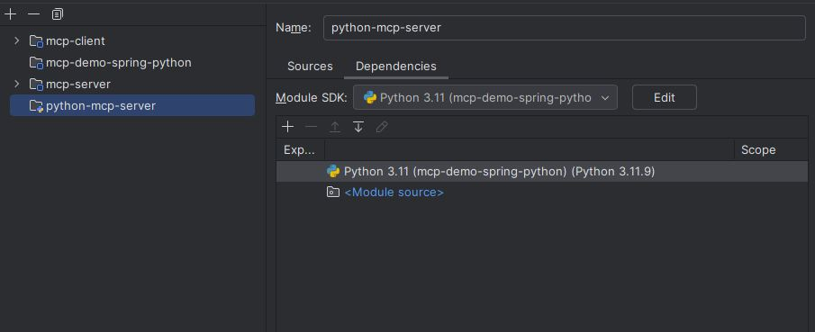

---

## Conclusion

Ce projet nous a permis de mettre en pratique les concepts de l’intelligence artificielle appliqués à un contexte réel grâce au protocole MCP. En connectant un client intelligent à un serveur de connaissances via des outils bien définis, nous avons pu automatiser des réponses basées sur des données métier. Malgré certaines contraintes techniques rencontrées, ce travail constitue une base solide pour développer des agents intelligents, modulaires et extensibles.

---

